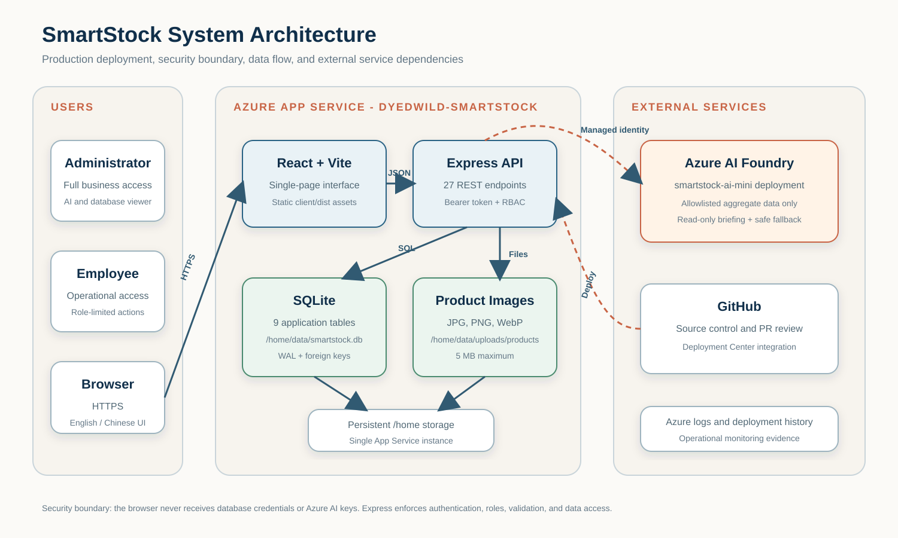

# Production Support and Testing

## 1. Purpose and Support Scope

This document explains how to monitor, validate, troubleshoot, and recover the SmartStock production application. It covers the React frontend, Express REST API, SQLite database, product-image storage, Azure App Service, Azure AI integration, and GitHub deployment path.

## 2. Service Dependency Diagram



The browser sends HTTPS requests to the React interface and the Express REST API hosted in the same Azure App Service. Express authenticates each protected request, enforces role permissions, validates input, and reads or writes SQLite. The AI controller reads only approved aggregates and contacts Azure AI through the App Service managed identity. GitHub supplies the source revision deployed by Azure Deployment Center.

## 3. Component Monitoring and Health Checks

SmartStock does not expose a dedicated public `/health` endpoint. Support personnel use the following least-privilege smoke sequence instead.

| Component | Health signal | Healthy result | Where to check |
|---|---|---|---|
| Azure App Service | Landing page request | Login page loads over HTTPS | Production URL and Azure Overview |
| React frontend | Static assets and navigation | Login form renders without a blank screen | Browser and browser console |
| Express API | Authentication request | Valid demo login returns HTTP 200 | Postman or application login |
| Authentication | Current-user request | `GET /api/auth/me` returns the signed-in user | Postman or workspace header |
| SQLite | Approved table catalog | Database Viewer shows 9 tables | Administrator Database page |
| Inventory data | Product listing | `GET /api/products` returns product records | Products page or Postman |
| Uploaded images | Static file request | Image returns HTTP 200 | Product card and `/uploads/products/...` URL |
| Azure AI | Briefing generation | Dashboard shows `AZURE AI`, four insights, and `Read only` | Administrator dashboard |
| AI audit log | Activity row | `ai_activity_logs` receives a success or error event | Database Viewer |
| Deployment | Build and release status | Latest main-branch deployment succeeds | Azure Deployment Center |

## 4. Logs and Operational Evidence

| Evidence | Content | Access path |
|---|---|---|
| Application console | Startup message, unhandled errors, AI fallback warnings | Local terminal or Azure Log Stream |
| Azure Log Stream | Runtime stdout/stderr when App Service logging is enabled | Azure Portal > App Service > Monitoring > Log stream |
| Deployment logs | Source commit, build output, dependency installation, startup result | Azure Portal > App Service > Deployment Center > Logs |
| Persistent log folder | App Service filesystem logs | `/home/LogFiles` through SSH or Advanced Tools |
| AI audit table | Provider, status, language, row count, duration, user, timestamp | Database Viewer > Ai Activity Logs |
| Automated test JSON | Test ID, scenario, expected value, actual value, status, duration | `evidence/API_Test_Results.json` |

Passwords, session tokens, request authorization headers, and Azure access tokens must not be copied into tickets or screenshots.

## 5. Common Incidents and Recovery

### 5.1 Browser or Postman reports `ECONNREFUSED`

1. Confirm the requested base URL and port.
2. For local work, start SmartStock from the repository root with `npm start`.
3. Confirm the terminal displays `SmartStock backend listening on http://localhost:4000`.
4. Set Postman `baseUrl` to `http://localhost:4000` for local testing or the production HTTPS URL for Azure.
5. Retry login before testing protected endpoints.

### 5.2 API returns `401 Session expired or invalid`

1. Send `POST /api/auth/login` again.
2. Replace the Postman bearer token with the newly returned token.
3. Confirm the `Authorization` header is `Bearer <token>`.
4. Do not reuse a token after logout. Sessions expire after seven days.

### 5.3 SQLite data disappears after deployment or restart

1. Confirm `SMARTSTOCK_DB_PATH=/home/data/smartstock.db`.
2. Confirm `WEBSITES_ENABLE_APP_SERVICE_STORAGE=true`.
3. Confirm the app is using one App Service instance; this SQLite design is not intended for multi-instance writes.
4. Use Azure SSH to confirm the database and WAL files exist under `/home/data`.
5. Restart the application only after verifying the path. Do not replace the database with a stale local copy.

### 5.4 Product image upload fails

1. Confirm the user is an administrator.
2. Confirm the file is JPG, PNG, or WebP and no larger than 5 MB.
3. Confirm `SMARTSTOCK_UPLOAD_DIR=/home/data/uploads/products` in Azure.
4. Confirm `/home` persistence is enabled and the folder is writable.
5. Retry with a small known-good PNG and check the returned `image_url`.

### 5.5 Azure AI is unavailable

1. Confirm `AZURE_OPENAI_ENABLED=true`, the endpoint, and the deployment name.
2. Confirm the App Service system-assigned identity is enabled.
3. Confirm that identity has the `Cognitive Services OpenAI User` role on the AI resource.
4. Review the application warning and the latest `ai_activity_logs` record.
5. SmartStock automatically returns a deterministic local read-only briefing, so inventory operations remain available while AI access is repaired.

### 5.6 Azure deployment fails or the app does not start

1. Open Deployment Center and identify the failing commit and build step.
2. Confirm Node.js 24 is selected and the repository root contains `package.json`.
3. Confirm the frontend build completed and `client/dist/index.html` exists.
4. Confirm `npm start` launches `server/index.js`.
5. If the new deployment is unusable, redeploy the last known-good commit and repeat the smoke test.

## 6. Automated Test Strategy and Results

The automated suite starts the real Express application on an ephemeral local port and uses an isolated temporary SQLite database. It sends real HTTP requests and compares status codes, response bodies, permissions, validation behavior, and data changes with expected results. The test database and uploaded test files are removed after execution.

| Test layer | SmartStock implementation | Result |
|---|---|---|
| Validation/controller behavior | Invalid credentials, duplicate SKU, invalid image type, negative stock, and authorization cases | Covered within HTTP suite |
| API integration | Express routes, authentication middleware, controllers, SQLite, file upload, and transactions | 45/45 passed |
| Workflow/end-to-end API | Login-to-operation flows, sale-to-stock verification, adjustment-to-history verification, logout invalidation | Passed |
| Manual UI validation | Login, navigation, dashboard, products, inventory, database viewer, and AI briefing | Passed locally |
| Post-deployment smoke validation | Azure landing page, login, dashboard, database viewer, and Azure AI briefing | Passed August 24, 2026 |

Command:

```bash
cd server
npm test
```

Expected result:

```text
SmartStock API tests: 45/45 passed
```

Detailed evidence is available in [API Test Cases and Results](API_Test_Cases_and_Results.xlsx) and [the machine-readable JSON report](../evidence/API_Test_Results.json).

## 7. Manual Test Results

| ID | Scenario | Expected | Actual | Result |
|---|---|---|---|---|
| MT-01 | Sign in as administrator | Dashboard opens with admin-only features | Dashboard, AI, and Database navigation displayed | Pass |
| MT-02 | Switch interface to Chinese and back | Labels translate without moving core navigation | Language switched and layout remained usable | Pass |
| MT-03 | Open product catalog | Eight seeded products and images display | Eight products displayed with images | Pass |
| MT-04 | Open inventory history | Movement rows and filters load | Initial movement history loaded | Pass |
| MT-05 | Open Database Viewer | Approved tables load without edit controls | Nine approved tables displayed read-only | Pass |
| MT-06 | Generate local AI preview | Four read-only insights display | Four insights displayed; no mutation controls | Pass |

## 8. Post-Deployment Smoke Test Results

Smoke test date: **August 24, 2026**  
Target: **https://dyedwild-smartstock.azurewebsites.net**

| Check | Observed result | Status |
|---|---|---|
| HTTPS landing page | SmartStock sign-in page loaded | Pass |
| Administrator login | Dashboard opened with Alicia Chen / Admin | Pass |
| Dashboard data | Product, inventory, revenue, order, and customer metrics loaded | Pass |
| SQLite integration | Database Viewer returned the approved table catalog | Pass |
| Azure AI | `AZURE AI` briefing returned four read-only insights | Pass |
| Data safety | Smoke test used read-only navigation and briefing generation only | Pass |

## 9. Backup, Recovery, and Limitations

- SQLite and product uploads are stored under Azure `/home/data` for persistence.
- Before any database replacement, stop writes and copy the database together with active WAL/SHM files or create a consistent SQLite backup.
- The Free F1 demonstration plan may cold-start and is not an availability guarantee.
- SQLite is appropriate for this single-instance workload, not high-volume multi-instance production scaling.
- A formal alerting system and dedicated health endpoint are future enhancements.
