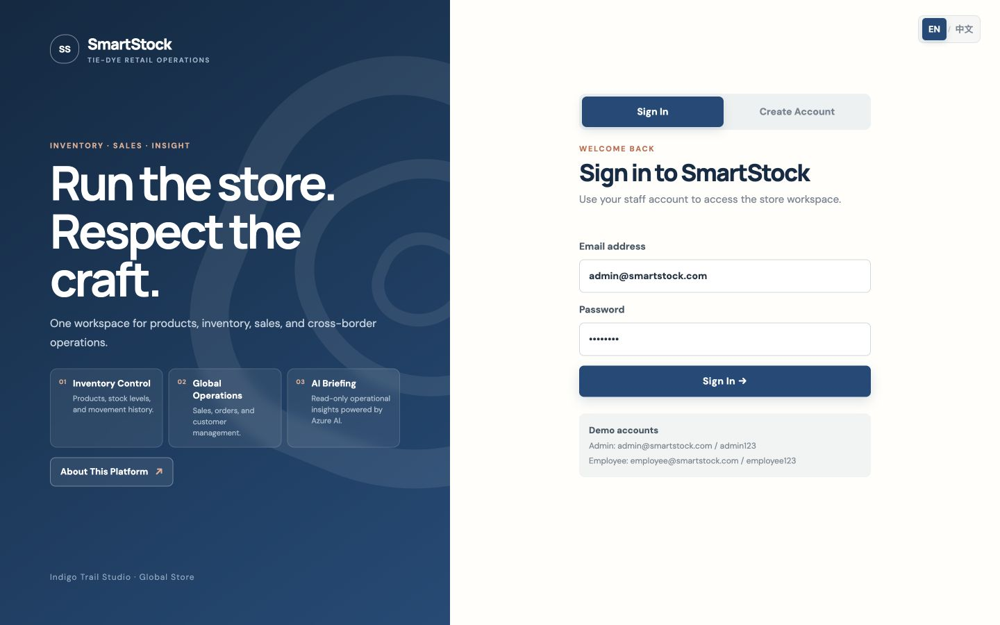
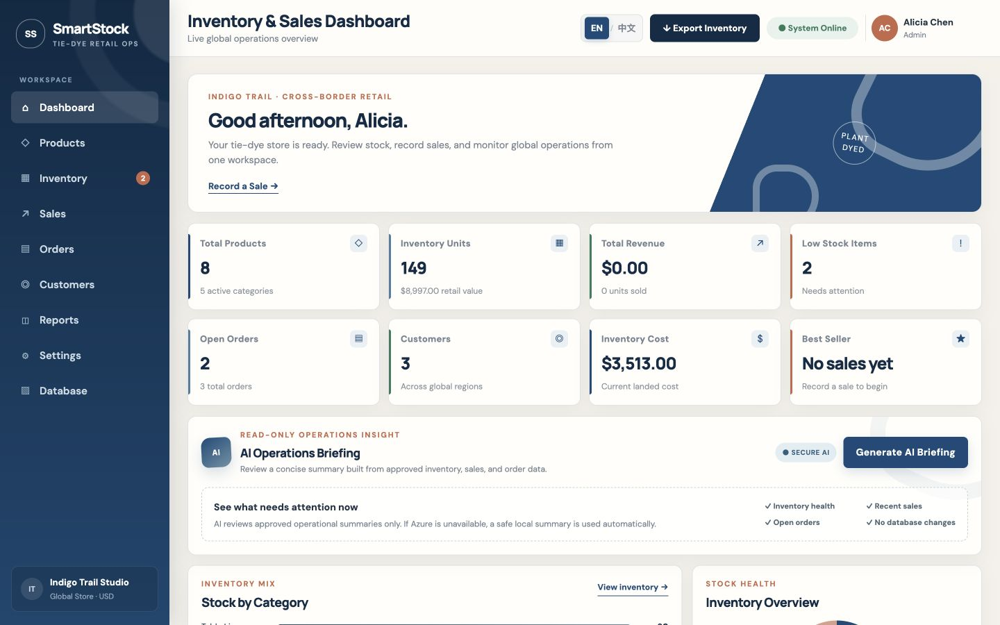
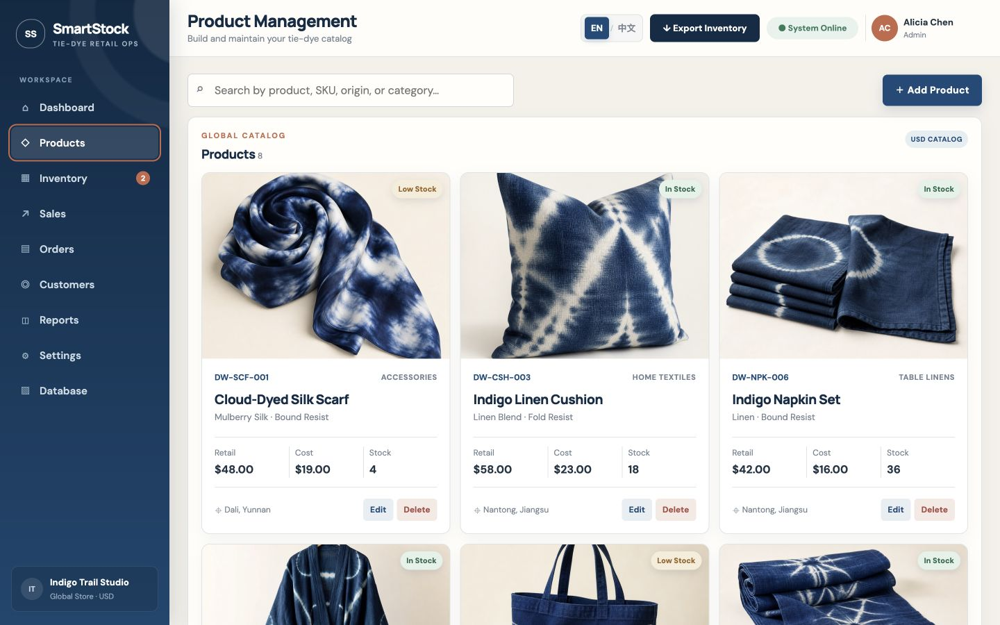
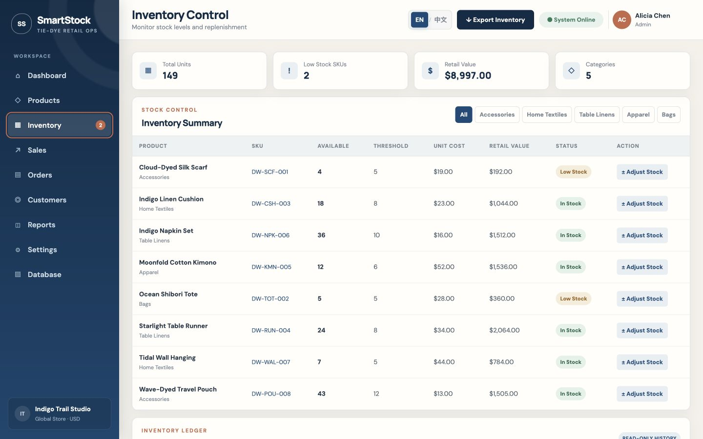
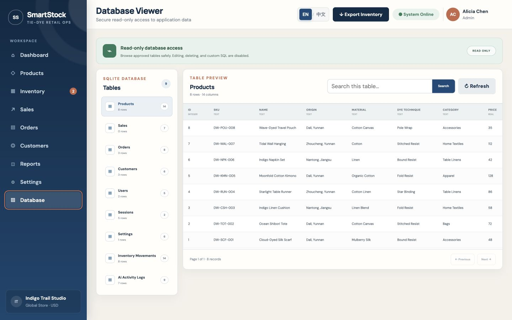
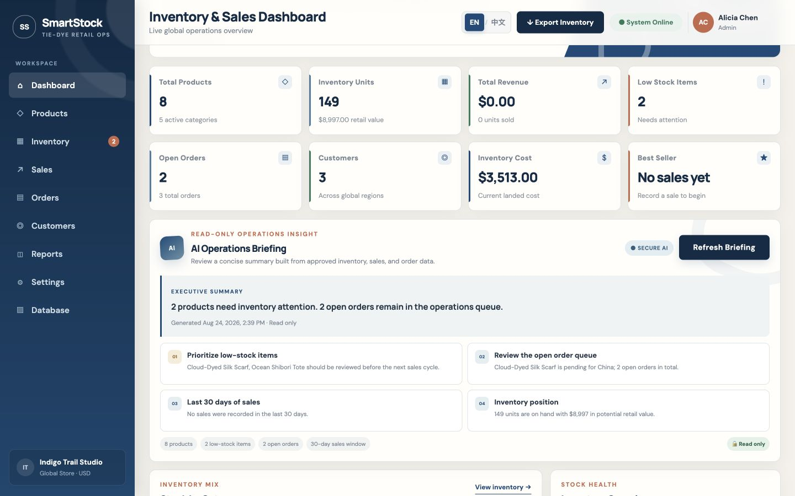

# System Usage Guide

## 1. Audience and Purpose

This guide is for store administrators and employees. SmartStock is a staff-facing operations system, not a consumer storefront. It helps a small cross-border tie-dye business manage product information, inventory, sales, orders, and customer records in one workspace.

## 2. Access Information

**Application:** [https://dyedwild-smartstock.azurewebsites.net](https://dyedwild-smartstock.azurewebsites.net)

Demonstration accounts:

| Role | Email | Password | Primary access |
|---|---|---|---|
| Administrator | `admin@smartstock.com` | `admin123` | All business functions, Database Viewer, AI briefing |
| Employee | `employee@smartstock.com` | `employee123` | Read access and permitted operational actions |

These are public demonstration credentials. They must be replaced before any real business deployment.

## 3. Sign In and Language

1. Open the application URL.
2. Select **EN** or **Chinese** in the upper-right language switch.
3. Enter the staff email and password.
4. Select **Sign In**.
5. Confirm the workspace displays the signed-in name and role.

New users may select **Create Account** to create an employee account. Administrator accounts can be created only by an authenticated administrator.

## 4. Dashboard

The Dashboard summarizes products, inventory units, retail value, revenue, low-stock items, orders, customers, inventory cost, and best-selling product. Low-stock cards and recent orders identify the next operational actions.

Use **Export Inventory** to download the current inventory view. Generated files may contain business data and should be handled appropriately.

## 5. Products

The Products page stores the catalog used by inventory and sales.

### Add a product

1. Open **Products**.
2. Select **Add Product**.
3. Enter a unique SKU, product name, category, craft origin, material, and dye technique.
4. Enter retail price, cost, quantity, and low-stock threshold.
5. Choose one image method:
   - paste a public Product Image URL; or
   - select **Choose Image** for a JPG, PNG, or WebP file up to 5 MB.
6. Review the image preview.
7. Save the product.

Only administrators can create, edit, delete, or upload product images. Products with sales history cannot be deleted.

## 6. Inventory Movement History

The Inventory page provides an immutable history of quantity changes.

Each movement records:

- product and SKU;
- movement type;
- signed quantity change;
- quantity before and after;
- operator;
- reason;
- source reference;
- timestamp.

### Make an administrator adjustment

1. Open **Inventory**.
2. Select the adjustment action.
3. Choose a product.
4. Enter a positive or negative change.
5. Enter a clear business reason.
6. Confirm the adjustment.
7. Verify both the product balance and the new movement row.

SmartStock blocks changes that would reduce inventory below zero.

## 7. Sales

### Record a sale

1. Open **Sales** or select **Record a Sale** from Dashboard.
2. Choose the product.
3. Enter quantity, destination region, and sales channel.
4. Submit the sale.
5. Confirm the sale appears in history.
6. Open Inventory and confirm stock decreased with a `SALE` movement.

The server calculates the total from the saved product price. Sale creation and stock reduction occur in one database transaction.

## 8. Orders

The Orders page tracks purchase and international orders.

### Create an order

1. Open **Orders**.
2. Select **Create Order**.
3. Choose the order type and status.
4. Enter supplier or channel, product, destination region, and quantity.
5. Select **Create Order**.

Administrators can update order status as the order moves from pending to transit, delivery, or cancellation.

## 9. Customers

The Customer Directory stores cross-border customer contact and region information.

### Add a customer

1. Open **Customers**.
2. Select **Add Customer**.
3. Enter name, email, phone, and region.
4. Save the record.

Administrators may delete a customer only when the customer has no purchase history. This protects historical business records.

## 10. Reports and Settings

- **Reports** presents inventory and sales summaries.
- **Settings** stores store name, email, default stock threshold, administrator display name, and currency.

Only administrators can modify settings.

## 11. Database Viewer

The Database Viewer gives administrators safe, read-only access to approved application tables.

1. Open **Database**.
2. Select an approved table.
3. Search records if needed.
4. Use pagination for larger tables.
5. Select Refresh to retrieve current records.

Custom SQL, editing, and deletion are disabled. Sensitive password hashes and full session tokens are not displayed.

## 12. AI Operations Briefing

The administrator-only AI briefing summarizes approved inventory, recent sales, and open-order aggregates. It never changes inventory or creates orders.

1. Open **Dashboard** as an administrator.
2. Select **Generate AI Briefing**.
3. Review the executive summary and four insights.
4. Confirm the card shows **Read only**.
5. Select **Refresh Briefing** when current data changes.

In Azure, the card displays `AZURE AI` when the model responds. If Azure AI is temporarily unavailable, SmartStock automatically returns a safe local fallback.

## 13. Sign Out

1. Select the user profile in the upper-right corner.
2. Select the sign-out action.
3. Confirm the login screen returns.

The previous session token is invalid after logout.

## 14. Known Limitations and Gotchas

- SmartStock is an internal operations platform; it does not provide consumer checkout.
- The Azure Free F1 plan can cold-start after inactivity.
- SQLite is configured for one App Service instance and demonstration-scale workload.
- The AI briefing is advisory and read-only.
- Image files must be JPG, PNG, or WebP and at most 5 MB.
- Product SKUs must be unique.
- Products and customers linked to historical activity may be protected from deletion.
- Demo credentials are not appropriate for real customer or production data.

## 15. Support Contact

For application defects or documentation corrections, open a GitHub issue at [https://github.com/RuhangLiu/SmartStock/issues](https://github.com/RuhangLiu/SmartStock/issues). Include the page, time, expected behavior, actual behavior, and a screenshot without passwords or tokens.
