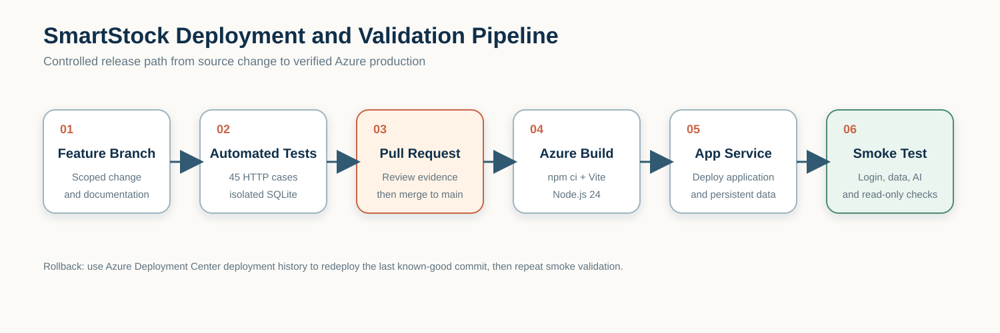

# Deployment Pipeline and Security Considerations

## 1. Deployment Pipeline

1. Create a scoped feature branch.
2. Implement code and documentation changes.
3. Run the 45-case API suite against temporary SQLite.
4. Open a pull request and review the diff and test evidence.
5. Merge to `main` after approval.
6. Azure Deployment Center builds the Vite client and starts the Node.js application.
7. Run read-only production smoke tests.

Microsoft documents GitHub-based App Service deployment through Deployment Center in [Deploy to App Service using GitHub Actions](https://learn.microsoft.com/en-sg/azure/app-service/deploy-github-actions).

## 2. Approval and Rollback

- Pull-request approval is the release gate.
- Automated tests must pass before merge.
- A deployment is not complete until the production smoke test passes.
- If the application fails, redeploy the last known-good commit or revert through a new pull request.
- Do not roll back the SQLite file automatically with the application package.

## 3. Authentication and Authorization

- Passwords are salted and hashed with scrypt.
- Bearer tokens are stored in `sessions` and expire after seven days.
- `requireAuth` protects business endpoints.
- `requireRole('admin')` protects sensitive operations.
- Public signup creates employee accounts only.

## 4. Database Security

- Prepared statements are used for application values.
- Foreign keys and transactions protect consistency.
- Sale creation and inventory reduction are atomic.
- Inventory changes and movement-history creation are atomic.
- The admin Database Viewer uses approved table definitions and does not accept arbitrary SQL.
- Password hashes and complete session tokens are excluded from viewer results.

## 5. File Upload Security

- Administrator-only endpoint.
- One file per request.
- Allowed MIME types: JPEG, PNG, WebP.
- Maximum size: 5 MB.
- Server-generated UUID filenames.
- Persistent storage outside the deployable application package.

## 6. Azure AI Security

- The browser never calls Azure AI directly.
- The server reads only allowlisted inventory, order, and sales aggregates.
- Detailed lists are limited to five rows.
- Output is limited to four insights and parsed as strict JSON.
- The AI cannot execute SQL or call mutation endpoints.
- Every request writes a safe activity log without prompt text, password, bearer token, or Azure token.
- App Service uses a system-assigned managed identity with the least-privilege `Cognitive Services OpenAI User` role.
- A deterministic local fallback keeps the dashboard usable when Azure AI is unavailable.

## 7. Secret Management

Allowed nonsecret application settings include endpoints, paths, deployment names, and feature flags. The following must never be committed:

- Azure access tokens or API keys;
- real passwords;
- bearer/session tokens;
- production database copies;
- private customer data;
- exported logs containing authorization headers.

## 8. Production Hardening Recommendations

The current deployment is suitable for controlled small-business operation, but a larger commercial deployment should also:

1. Replace public demo credentials and enforce strong password policy.
2. Add HTTPS security headers, request-rate limits, and CSRF review.
3. Add centralized telemetry, alerts, and a protected health endpoint.
4. Add scheduled database backups and tested recovery procedures.
5. Migrate to a managed database before multi-instance scaling.
6. Add a staging environment and protected deployment approvals.
7. Add dependency and secret scanning to CI.
